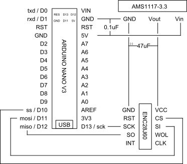

# SearchAThing.Arduino.Enc28j60


## Hardware

Here up you can see an Arduino Nano v3 connected to the ethernet through an Enc28j60 breakout board powered directly from the USB. As you can see from the USB power meter tool the power consume is about 0.14A that is under 0.5A max of the standard pc USB ports. This current need came primarily from the Enc28j60 chip, while the Atmega328 is really low in power consumption. A separate voltage regulator using the AMS1117 3.3 regulates the input 5V to 3.3V for the purpose of the Enc28j60 Vcc while the SPI interface is 5V tolerant.



## Software


## Examples summary

| example | description |
|---|---|
| [Basic (static ip)] | Basic networking using static ip address |
| [Basic (dynamic)] | Basic networking using dynamic ip address |
| [SRUDP] | About SRUDP protocol |
| [SRUDP (echo client)] | Echo client using SRUDP protocol |
| [SRUDP (echo server)] | Echo server using SRUDP protocol |
| [SRUDP-TCP-Bridge] | Connect to an SRUDP Arduino server through telnet using an SRUDP-TCP-Bridge application |
| [Arduino Servo] | Drive arduino from C# using Arduino Servo Client |

## Source code

To install the library just clone [this git repository](https://github.com/devel0/SearchAThing.Arduino.Enc28j60) into your Documents/Arduino/libraries folder. All code excerpts in this page are parts of the [SearchAThing.Arduino.Enc28j60.Examples](https://github.com/devel0/SearchAThing.Arduino.Enc28j60.Examples) release under MIT license by Lorenzo Delana (C) 2016. 

## Basic (static ip)

### example

```c++
//===========================================================================
// EXAMPLE	: ex01-basic-static.ino
//===========================================================================
// Setup()
//   - Allocate the enc28j60 driver
//   - Allocate the network infrastructure manager
//   - Set static-ip-mode parameters
//   - Query a name through the dns server
// Loop()
//   - Maintenance loop routine to keep working default packet handlers
//     (arp,icmp,...)
//---------------------------------------------------------------------------
// Suggested defines for this example
//---------------------------------------------------------------------------
// SEARCHATHING_DISABLE;DEBUG;DEBUG_ASSERT;DPRINT_SERIAL
//

// SearchAThing.Arduino debug macro definitions
#include <SearchAThing.Arduino.Utils\DebugMacros.h>

//---------------------------------------------------------------------------
// Libraries
//---------------------------------------------------------------------------
#include <MemoryFree.h>
#include <SPI.h>

#include <SearchAThing.Arduino.Utils\Util.h>
using namespace SearchAThing::Arduino;

#include <SearchAThing.Arduino.Net\Checksum.h>
using namespace SearchAThing::Arduino::Net;

#include <SearchAThing.Arduino.Net\EthNet.h>
#include "Driver.h"
using namespace SearchAThing::Arduino::Enc28j60;

//---------------------------------------------------------------------------
// Global variables
//---------------------------------------------------------------------------

// network card driver
EthDriver *drv;

// network manager
EthNet *net;

//---------------------------------------------------------------------------
// Setup
//---------------------------------------------------------------------------
void setup()
{
  // init
  {
    // network card init ( mac = 00:00:6c:00:00:[01] )
    drv = new Driver(PrivateMACAddress(1));

    // network manager init [static-mode]
    net = new EthNet(drv, RamData::FromArray(IPV4_IPSIZE, 192, 168, 0, 40));

    // static network parameters
    net->SetNetmask(RamData::FromArray(IPV4_IPSIZE, 255, 255, 255, 0));
    net->SetGateway(RamData::FromArray(IPV4_IPSIZE, 192, 168, 0, 1));
    net->SetDns(RamData::FromArray(IPV4_IPSIZE, 8, 8, 8, 8));
    net->SetBroadcastAddress(RamData::FromArray(IPV4_IPSIZE, 192, 168, 0, 255));
  }

  DPrint(F("MAC\t")); DPrintHexBytesln(net->MacAddress());
  DPrint(F("IP\t")); DPrintBytesln(net->IpAddress());
  DPrintln(F("setup done"));
  DNewline();

  DPrint(F("github ip = ")); DPrintBytesln(net->ResolveIP("github.com"));

  PrintFreeMemory();
}

//---------------------------------------------------------------------------
// Loop
//---------------------------------------------------------------------------
void loop()
{
  net->Receive(); // receive packet ( if any )
  net->FlushRx(); // process packet using registered default handlers, then discard it
}
```

#### Sketch size

Program size: 13.752 bytes (used 45% of a 30.720 byte maximum) (4,84 secs)
Minimum Memory Usage: 66 bytes (3% of a 2048 byte maximum)

#### Expected output

```
MAC    00-00-6c-00-00-01
IP    192.168.0.40
setup done

github ip = 192.30.252.128
free blk=1014 frg=1151
```

#### Description

- initialize the nic card driver using a private MAC address
- initialize the network subsystem using the driver and the static ip ( 192.168.0.40 )
- sets static network parameters 
	- netmask : 255.255.255.0
	- gateway : 192.168.0.1
	- dns : 8.8.8.8
	- broadcast : 192.168.0.255
- resolve the "github.com" name using an internet dns through the local gateway due to the fact that the ip AND netmask != network address.

## Basic (dynamic dhcp)

### Examples

```c++
//======================================================================
// EXAMPLE	: ex02-basic-dhcp.ino
//======================================================================
// Setup()
//   - Allocate the enc28j60 driver
//   - Allocate the network infrastructure manager
//   - Set dynamic-ip-mode parameters
//   - Query a name through the dns server
// Loop()
//   - Maintenance loop routine to keep working default packet handlers (arp,icmp,...)
//----------------------------------------------------------------------
// Suggested defines for this example
//----------------------------------------------------------------------
// SEARCHATHING_DISABLE;DEBUG;DEBUG_ASSERT;DPRINT_SERIAL;USE_DHCP
//

// SearchAThing.Arduino debug macro definitions
#include <SearchAThing.Arduino.Utils\DebugMacros.h>

//----------------------------------------------------------------------
// Libraries
//----------------------------------------------------------------------
#include <MemoryFree.h>
#include <SPI.h>

#include <SearchAThing.Arduino.Utils\Util.h>
using namespace SearchAThing::Arduino;

#include <SearchAThing.Arduino.Net\Checksum.h>
using namespace SearchAThing::Arduino::Net;

#include <SearchAThing.Arduino.Net\EthNet.h>
#include "Driver.h"
using namespace SearchAThing::Arduino::Enc28j60;

//----------------------------------------------------------------------
// Global variables
//----------------------------------------------------------------------

// network card driver
EthDriver *drv;

// network manager
EthNet *net;

//----------------------------------------------------------------------
// Setup
//----------------------------------------------------------------------
void setup()
{
  // init
  {
    // network card init ( mac = 00:00:6c:00:00:[01] )
    drv = new Driver(PrivateMACAddress(1));

    // network manager init [dynamic-mode]
    net = new EthNet(drv);
  }

  DPrint(F("MAC\t")); DPrintHexBytesln(net->MacAddress());
  net->PrintSettings(); // print network settings

  DPrintln(F("setup done"));
  DNewline();

  DPrint(F("github ip = ")); DPrintBytesln(net->ResolveIP("github.com"));

  PrintFreeMemory();
}

//----------------------------------------------------------------------
// Loop
//----------------------------------------------------------------------
void loop()
{
  net->Receive(); // receive packet ( if any )
  net->FlushRx(); // process packet using registered default handlers, then discard it
}
```

#### Sketch size

Program size: 16.388 bytes (used 53% of a 30.720 byte maximum) (1,11 secs)
Minimum Memory Usage: 92 bytes (4% of a 2048 byte maximum)

#### Expected output

```
MAC     00-00-6c-00-00-01
IP      192.168.0.40
HOST    arduinotest.searchathing.com
DOMAIN  searchathing.com
GW      192.168.0.1
BRD     192.168.0.255
DNS     192.168.0.1
NM      255.255.255.0
LEASE   600 (secs)
setup done

github ip = 192.30.252.120
free blk=933 frg=1070
```

#### Description

- initialize the nic card driver using a private MAC address
- initialize the network subsystem using the driver and dynamic dhcp
- print current network settings
- resolve the "github.com" name

## SRUDP

Information about this protocol can be found [here](https://github.com/devel0/SearchAThing.Arduino.Net#srudp)

### SRUDP (echo client)

To run the SRUDP echo client on the Arduino successfully there is the need of a party server that can be another 2th Arduino running the SRUDP server or for simplicity you can use another VS instance running the SRUDP echo server app using C#. To start SRUDP server app in C#: 
- clone the SearchAThing.Net and SearchAthing.Net.Apps projects from github
- open the Net.Apps project and right click on the SearchAthing.Net.SRUDP.EchoServer → Set as Startup Project
- set your pc ip address in the EchoServer.cs
- hit F5 and accept the firewall rule to allow local connections

#### Example

```c++
//===========================================================================
// EXAMPLE	: ex03-srudp-echo-client.ino
//===========================================================================
// Setup()
//   - Allocate the enc28j60 driver
//   - Allocate the network infrastructure manager
//   - SRUDP client
//		- Connect to remote endpoint
//      - Send Data and received back
//      - Disconnect
// Loop()
//   - Maintenance loop routine to keep working default packet handlers
//     (arp,icmp,...)
//---------------------------------------------------------------------------
// Suggested defines for this example
//---------------------------------------------------------------------------
// SEARCHATHING_DISABLE;DEBUG;DPRINT_SERIAL;USE_DHCP
//

// SearchAThing.Arduino debug macro definitions
#include <SearchAThing.Arduino.Utils\DebugMacros.h>

//---------------------------------------------------------------------------
// Libraries
//---------------------------------------------------------------------------
#include <MemoryFree.h>
#include <SPI.h>

#include <SearchAThing.Arduino.Utils\Util.h>
using namespace SearchAThing::Arduino;

#include <SearchAThing.Arduino.Net\EthNet.h>
using namespace SearchAThing::Arduino::Net;

#include <SearchAThing.Arduino.Net\SRUDP_Client.h>
using namespace SearchAThing::Arduino::Net::SRUDP;

#include "Driver.h"
using namespace SearchAThing::Arduino::Enc28j60;

//---------------------------------------------------------------------------
// Global variables
//---------------------------------------------------------------------------

// network card driver
EthDriver *drv;

// network manager
EthNet *net;

//---------------------------------------------------------------------------
// Setup
//---------------------------------------------------------------------------
void setup()
{
  {
    // init
    {
      // network card init ( mac = 00:00:6c:00:00:[01] )
      drv = new Driver(PrivateMACAddress(1));

      // network manager init [dynamic-mode]
      net = new EthNet(drv);
    }

    DPrint(F("MAC\t")); DPrintHexBytesln(net->MacAddress());
    net->PrintSettings(); // print network settings

    DPrintln(F("setup done"));
    DNewline();
  }

  //
  auto remoteIp = RamData::FromArray(IPV4_IPSIZE, 192, 168, 0, 80);
  auto remotePort = 50000;

  Client client(net, IPEndPoint(remoteIp, remotePort));
  client.Connect();

  if (client.State() != ClientState::Connected)
  {
    DPrintln(F("unable to connect"));
  }
  else
  {
    auto i = 0;
    while (i < 200)
    {
      char buf[50];
      sprintf(buf, "Hi, there [%d]", i);
      if (client.Write(RamData(buf)))
      {
        RamData res;
        if (client.Read(res) == TransactionResult::Successful)
        {
          DPrint(F("received=[")); res.PrintAsChars(); DPrintln(F("]"));
          ++i;
        }
      }
      else
        DPrintln(F("write failed"));
    }
    client.Disconnect();
  }

  PrintFreeMemory();
}

//---------------------------------------------------------------------------
// Loop
//---------------------------------------------------------------------------
void loop()
{
  net->Receive(); // receive packet ( if any )
  net->FlushRx(); // process packet using registered default handlers, then
          // discard it
}
```

#### Sketch size

Program size: 18.512 bytes (used 60% of a 30.720 byte maximum) (5,00 secs)
Minimum Memory Usage: 96 bytes (5% of a 2048 byte maximum)

#### Expected output

```
MAC      00-00-6c-00-00-01
IP       192.168.0.40
HOST     arduinotest.searchathing.com
DOMAIN   searchathing.com
GW       192.168.0.1
BRD      192.168.0.255
DNS      192.168.0.1
NM       255.255.255.0
LEASE    600 (secs)
setup done

received=[Hi, there [0]]
received=[Hi, there [1]]
received=[Hi, there [2]]
received=[Hi, there [3]]
...
received=[Hi, there [199]]
free blk=828 frg=954
```

#### Description

- Setup network using dhcp.
- Connect the SRUDP server 192.168.0.80:50000
- Write a test string and print the received echo result for 200 times.
- Disconnect from the server.

#### Inspecting SRUDP data using Wireshark dissector

If you have Wireshark installed you can view at the SRUDP protocol just by copy the srudp.lua file ( that you can find in the SearchAThing.Net/SRUDP folder ) into the dissector folder `C:\Program Files\Wireshark\plugins\2.0.2` After that the dissector automatically enable for port=50000 so for the above test it will show something like this: 


In the Info column there is information about the SRUDP protocol ID and type of packet while in the detail there is information about Data. Consider that each part maintain its own TX ID while the other part use the received ID only when respond with ACKs. 

### SRUDP (echo server)

To run the SRUDP echo server on the Arduino successfully there is the need of a party client that can be another 2th Arduino running the SRUDP client or for simplicity you can use another VS instance running the SRUDP echo client app using C#. To start SRUDP client app in C#: 
- clone the SearchAThing.Net and SearchAthing.Net.Apps projects from github
- open the Net.Apps project and right click on the SearchAthing.Net.SRUDP.EchoClient → Set as Startup Project
- set the arduino ip address in the EchoClient.cs
- hit F5

#### Example

```c++
//===========================================================================
// EXAMPLE	: ex04-srudp-echo-server.ino
//===========================================================================
// Setup()
//   - Allocate the enc28j60 driver
//   - Allocate the network infrastructure manager
//   - SRUDP listener
//		- Create a listener using current IP address as server endpoint
//      - Associate an handler for client connections
//      - Activate listener process
//      - Register the listener process to the network subsystem
// Loop()
//   - Maintenance loop routine to keep working default packet handlers
//     (arp, icmp, ...)
//		- listener process is included because registered into the network
//        subsystem
//---------------------------------------------------------------------------
// Suggested defines for this example
//---------------------------------------------------------------------------
// SEARCHATHING_DISABLE;DEBUG;DPRINT_SERIAL;USE_DHCP
//

// SearchAThing.Arduino debug macro definitions
#include <SearchAThing.Arduino.Utils\DebugMacros.h>

//---------------------------------------------------------------------------
// Libraries
//---------------------------------------------------------------------------
#include <MemoryFree.h>
#include <SPI.h>

#include <SearchAThing.Arduino.Utils\Util.h>
using namespace SearchAThing::Arduino;

#include <SearchAThing.Arduino.Net\EthNet.h>
using namespace SearchAThing::Arduino::Net;

#include <SearchAThing.Arduino.Net\SRUDP_Client.h>
using namespace SearchAThing::Arduino::Net::SRUDP;

#include "Driver.h"
using namespace SearchAThing::Arduino::Enc28j60;

//---------------------------------------------------------------------------
// Global variables
//---------------------------------------------------------------------------

// network card driver
EthDriver *drv;

// network manager
EthNet *net;

//---------------------------------------------------------------------------
// Setup
//---------------------------------------------------------------------------
void setup()
{
  // init
  {
    {
      // network card init ( mac = 00:00:6c:00:00:[01] )
      drv = new Driver(PrivateMACAddress(1));

      // network manager init [dynamic-mode]
      net = new EthNet(drv);
    }

    DPrint(F("MAC\t")); DPrintHexBytesln(net->MacAddress());
    net->PrintSettings(); // print network settings

    DPrintln(F("setup done"));
    DNewline();
  }

  //

  IPEndPoint remoteEndPoint = IPEndPoint(net->IpAddress(), 50000);

  while (true)
  {
    auto client = Client::Listen(net, remoteEndPoint);

    DPrint(F("client connected: ")); client.RemoteEndPoint().ToString().PrintAsChars(); DNewline();

    while (client.State() == ClientState::Connected)
    {
      RamData data;
      if (client.Read(data) == TransactionResult::Successful)
      {
        DPrint(F("Received [")); data.PrintAsChars(); DPrintln(F("]"));

        while (client.Write(data) != TransactionResult::Successful)
        {
          DPrintln(F("write failed"));
        }
      }
      else
        DPrintln(F("read failed"));
    }

    DPrintln(F("client received a disconnect"));

    PrintFreeMemory();
  }
}

//---------------------------------------------------------------------------
// Loop
//---------------------------------------------------------------------------
void loop()
{
  //net->Receive(); // receive packet ( if any )
  //net->FlushRx(); // process packet using registered default handlers,
  // then discard it
}
```

#### Sketch size

Program size: 17.528 bytes (used 57% of a 30.720 byte maximum) (0,73 secs)
Minimum Memory Usage: 96 bytes (5% of a 2048 byte maximum)

#### Expected output

```
MAC      00-00-6c-00-00-01
IP       192.168.0.40
HOST     arduinotest.searchathing.com
DOMAIN   searchathing.com
GW       192.168.0.1
BRD      192.168.0.255
DNS      192.168.0.1
NM       255.255.255.0
LEASE    600 (secs)
setup done

client connected: 192.168.0.80:57792
Received [Hi 0]
Received [Hi 1]
Received [Hi 2]
Received [Hi 3]
...
Received [Hi 199]
read failed
client received a disconnect
free blk=893 frg=1036
```

#### Description

- Setup network using dhcp on the ip:50000 
	- Print information about connected remote client ip:port
	- Loop while client connected 
		- Read and write back read data
		
## SRUDP-TCP-Bridge

To interact with an SRUDP arduino server through tcp telnet there is the need for a bridge application that can be found in the SearchAThing.Net.Apps. This application is design to run Windows or Linux ([mono](https://github.com/devel0/SearchAThing.Docker/tree/master/mono)) by command line: 
`SearchAThing.Net.SRUDP.TCPBridge.ServerApp.exe <srv-ip> <srv-port> [srudp-rx-buffer-size]`
The srv-ip and srv-port refer to a local server connection that the bridge will create to listen for TCP connections using follow SRUDP-TCP-Bridge protocol specifications. To run the bridge: 
- Open the solution and select as Startup Project the SearchAThing.Net.SRUDPTCPBridge.Server
- Set the command line through the Project Properties ( in Debug mode ) under the Debug -> Command line arguments set <bridge-srv-ip> <bridge-srv-port>. For example "192.168.0.80 51000".
- Hit F5 and accept the firewall rule for the local connections

### Running examples

Here is assumed that the Arduino run the SRUDP-Echo-Server ( 192.168.0.40:5000 ) and a pc in the network is running the SRUDP-TCP-Bridge ( 192.168.0.80:51000 ). I use telnet from cygwin to have the echo working by default.

### Basic connection to the bridge

```shell
$ telnet 192.168.0.80 51000
Trying 192.168.0.80...
Connected to 192.168.0.80.
Escape character is '^]'.
help
SRUDP TCP Wrapper v.0.5.0 info available at https://searchathing.com/?p=829
vers
OK
0.5.0
quit
OK
Connection closed by foreign host.
```

### Connection to the Arduino through telnet

```shell
$ telnet 192.168.0.80 51000
Trying 192.168.0.80...
Connected to 192.168.0.80.
Escape character is '^]'.
conn 192.168.0.40 50000
OK
waln test1
OK
rbin
OK
5
test1quit
OK
Connection closed by foreign host.
```

#### Expected arduino output

```
MAC      00-00-6c-00-00-01
IP       192.168.0.40
HOST     arduinotest.searchathing.com
DOMAIN   searchathing.com
GW       192.168.0.1
BRD      192.168.0.255
DNS      192.168.0.1
NM       255.255.255.0
LEASE    600 (secs)
setup done

client connected: 192.168.0.80:59351
Received [test1]
read failed
...
read failed
client received a disconnect
free blk=893 frg=1036
```

#### Description

| item | description |
|---|---|
| telnet 192.168.0.80 51000 | Connect to the SRUDP-TCP-Bridge |
| conn 192.168.0.40 50000 | Connect to the Arduino SRUDP echo server |
| waln test1 | Write an ASCII line "test1" |
| rbin | Read binary data. The use of "raln" not work here cause sent message not contains the newline and the received back message could not identified as a line without that, so here rbin ensure to read data even there is no newline |
| quit | close connection |

The arduino SRUDP server read failed messages are caused by the SRUDP echo server that expects some message until we issue the quit command to close the connection. 

## Arduino Servo

### Introduction

Arduino servo is an program for arduino that implement Servo commands over SRUDP protocol. There is also a C# client that allow you to connect any Arduino Servo thing through ethernet using the TcpClient. In order to do this there is the need to run an instance of a SRUDP-TCP-Bridge. 

Control an arduino over the network allow you to read or write the Arduino Servo implemented functions. Arduino Servo is an engine for arduino that speak to outside world through the SRUDP protocol. Typographical conventions: 
`<nl>` represents a newline
To issue commands and read results use SRUDP read and write functions available in a client implementation of the protocol. Currently and arduino and a C# implementation of the SRUDP protocol already exists. 

#### Commands

##### Uptime

States from how much time the device is up. 

*Syntax*
`uptime<nl>`

*Return value*
Retrieve the uptime in format days.milliseconds
`OK<nl><days>.<milliseconds><nl>`

##### Available RAM

Retrieve the quantity of available RAM in the Arduino. If <type> is 0 then the total fragment memory sum is reported, otherwise (eg. <type> is 1) the maximum contiguous block size is returned

*Syntax*
`free <type><nl>`

*Return value*
Return the sum of fragmented available ram <free-ram-bytes> if <type was 0, the maximum contiguous block otherwise.
`OK<nl><free-ram-bytes><nl>`

##### DS18B20 - PortSetup

Set the port where the ds18b20 temperature sensor are connected. It must be a digital port

*Syntax*
`ds18b20_setup <port><nl>`

*Return value*
ds18b20 port setup completed
`OK<nl>`

##### DS18B20 - Get device count

Retrieve the count of ds18b20 sensor connected to the port configured.

*Syntax*
`ds18b20_count<nl>`

*Return value*
Return the <count> quantity of temperature sensor detected
`OK<nl><count><nl>`

Error <err-msg> occurred: MissingSetup
`ERR <err-msg><nl>`

##### DS18B20 - Get temperature Celsius

Retrieve the temperature (Celsius) of the sensor with given index ( first = 0 ).

*Syntax*
`ds18b20_get <idx><nl>`

*Return value*
Return the temperature (Celsius) converted from the device at the given index
`OK<nl><temperature_C><nl>`

##### Set digital port mode

Set a digital port mode for input ( <mode> = IN ) or output ( <mode> = OUT )

*Syntax*
`digital_setup <port> <mode><nl>`

*Example*
Set the D3 as output
`digital_setup 3 OUT`

*Return value*
Operation completed.
`OK<nl>`

An <err-msg> occurred: InvalidSyntax
`ERR <err-msg><nl>`

##### Digital port write

Set value of given digital port

*Syntax*
`digital_write <port> <value><nl>`

*Example*
Set the D3 to value 255
`digital_setup 3 255`

*Return value*
Operation completed.
`OK<nl>`

An <err-msg> occurred: InvalidSyntax
`ERR <err-msg><nl>`

##### Digital port read

Get value of given digital port

*Syntax*
`digital_read <port><nl>`

*Return value*
Return the digital port current value.
`OK<nl><value><nl>`

An <err-msg> occurred: InvalidSyntax
`ERR <err-msg><nl>`

##### Analog port read

Get value of given analog port. Note: use numeric value to specify the <port> ( ex. A2 = 2 ). 

*Syntax*
`analog_read <port><nl>`

*Return value*
Return the analog port current value.
`OK<nl><value><nl>`

An <err-msg> occurred: InvalidSyntax
`ERR <err-msg><nl>`

##### Analog port read pack

Get value of given analog port for as many samples specified. Note: use numeric value to specify the <port> ( ex. A2 = 2 ).

*Syntax*
`analog_read_pack <port> <samples-count><nl>`

*Return value*
Each 10bit sample will be stored in two bytes, so <data-pack> will be 2x<samples-count> bytes
`OK<nl><data-pack>`

An <err-msg> occurred: InvalidSyntax, OutOfMemory, SamplesOutOfPkt
`ERR <err-msg><nl>`

### Example

```csharp
using SearchAThing.Net.SRUDP.TCPBridge.ServoClient;
using System;

namespace SearchAThing.Arduino.Servo.ClientTest
{
    class Program
    {
        static void Main(string[] args)
        {
            var client = new ServoClient("192.168.0.80", 51000, "192.168.0.40", 50000);

            while (true)
            {
                var a = client.AnalogRead(0);
                Console.SetCursorPosition(0, 0);
                Console.WriteLine($"a={a} v={a / 1023.0 * 4.52}");
            }
        }
    }
}
```

#### Description

- establish a connection to an Arduino servo 192.168.0.40:50000 by using the SRUDP-TCP-Bridge 192.168.0.80:51000
- forever loop 
	- read value from adc and convert to voltage
	
#### Demo

A demo its available [here](https://www.youtube.com/watch?v=0una39qpdIM)